# Hustl Sequence Diagrams

Mermaid.js sequence diagrams for every use case in the Hustl platform.

---

## Module: Authentication & Profile

### UC-1: Sign In

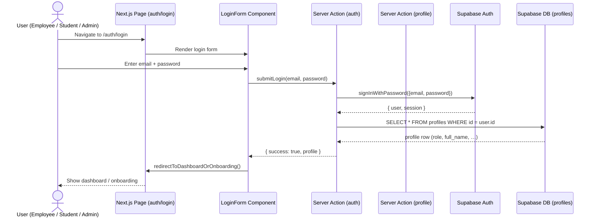

---

### UC-2: Sign Up (as Employee or Student)

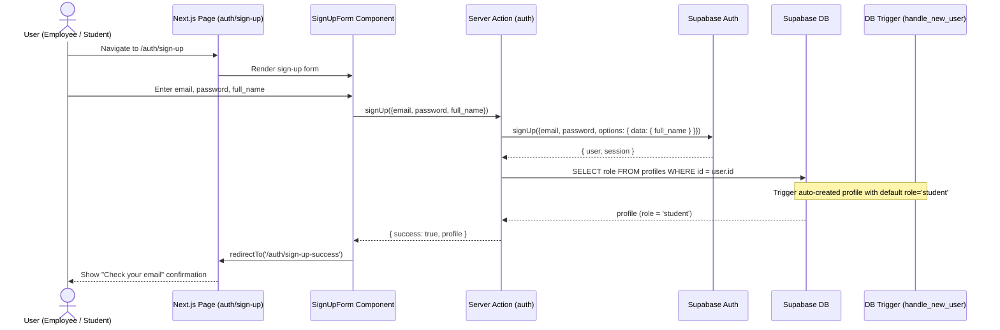

---

### UC-3: Manage Account & Profile

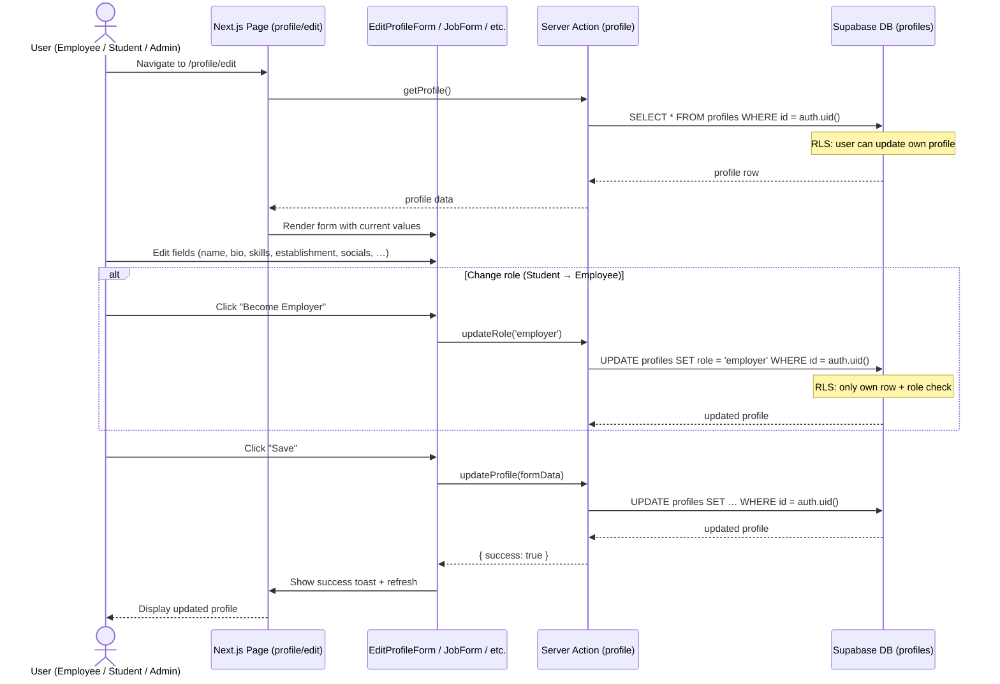

---

## Module: Gig Management

### UC-4: Browse / Search / Filter Gigs

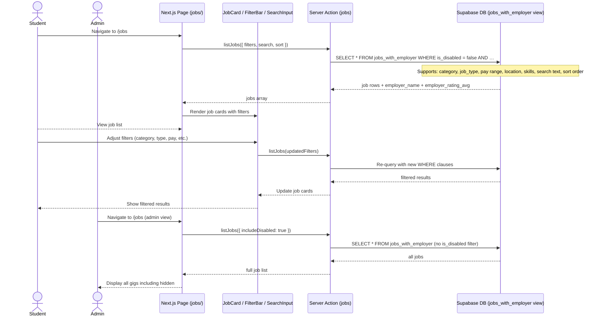

---

### UC-5: View Gig Details

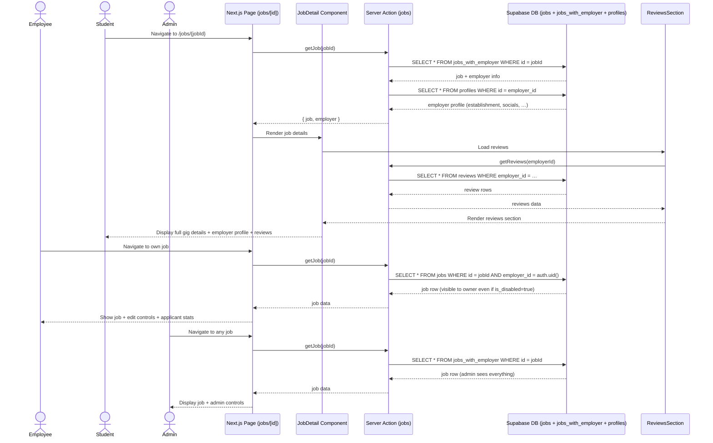

---

### UC-6: Save / Bookmark Gigs

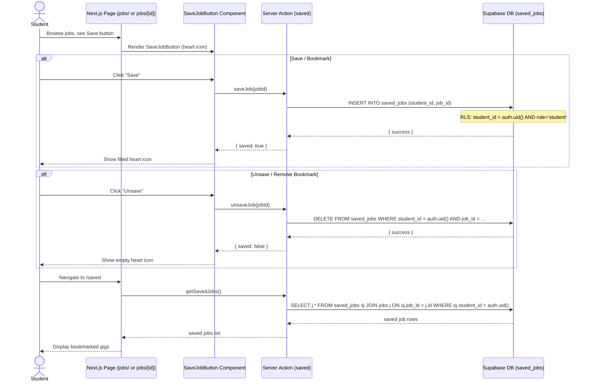

---

### UC-7: Post a Gig

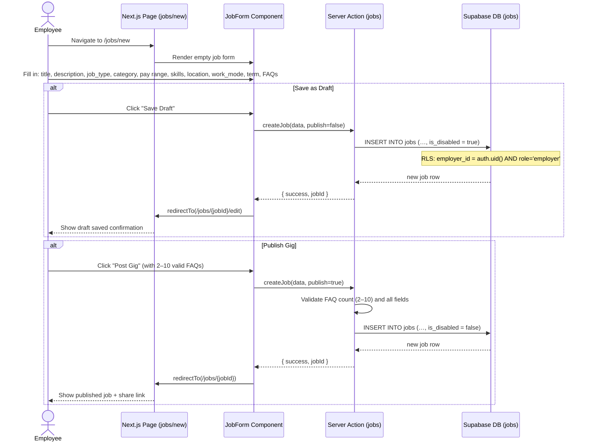

---

### UC-8: Manage Posted Gigs & Applicants

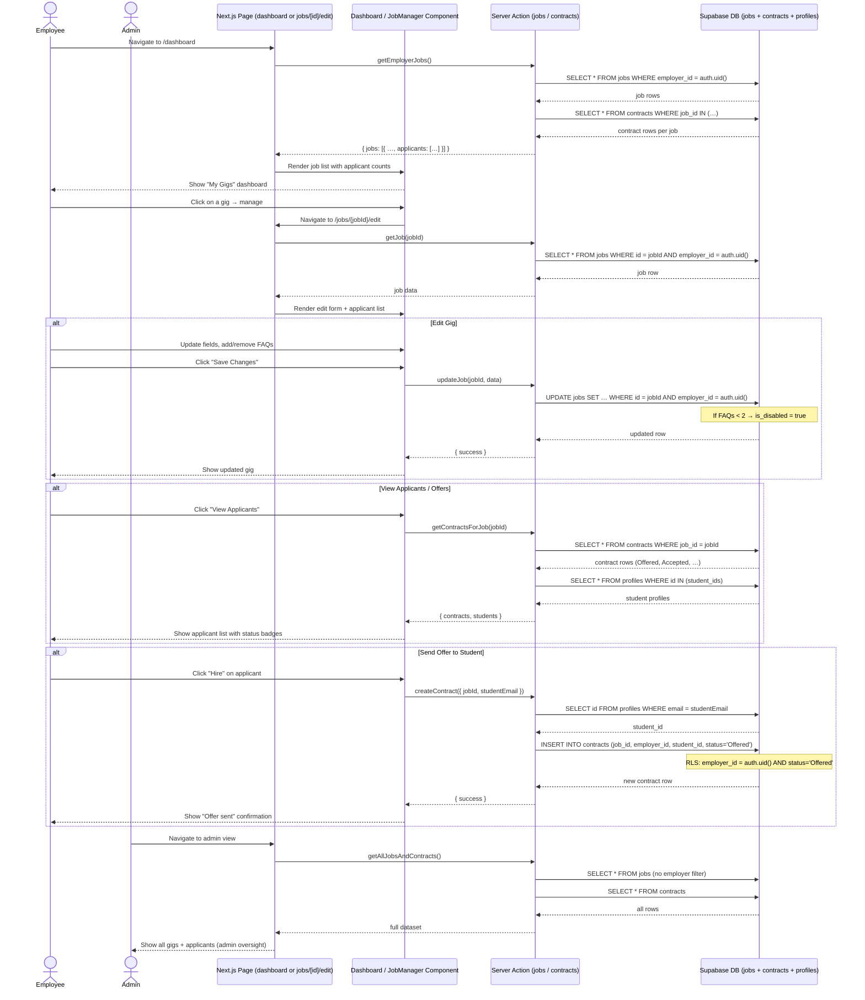

---

## Module: Application Process

### UC-9: Apply to a Gig

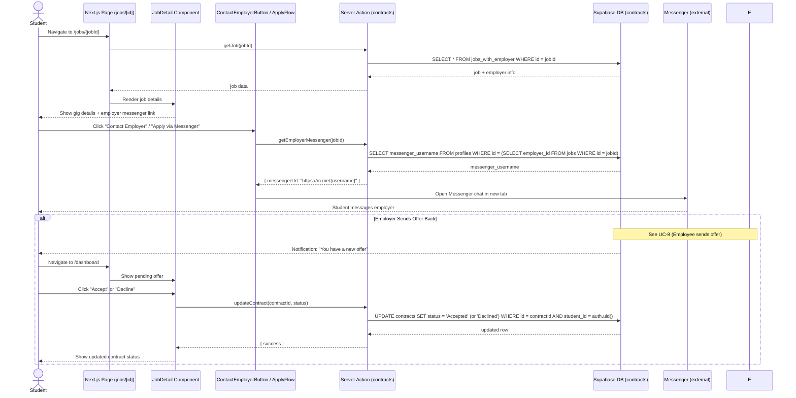

---

### UC-10: Track Applications

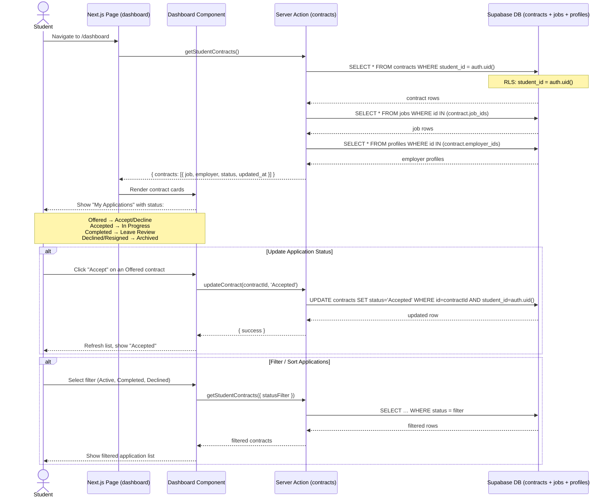

---

## Module: Communication & Feedback

### UC-11: Notifications

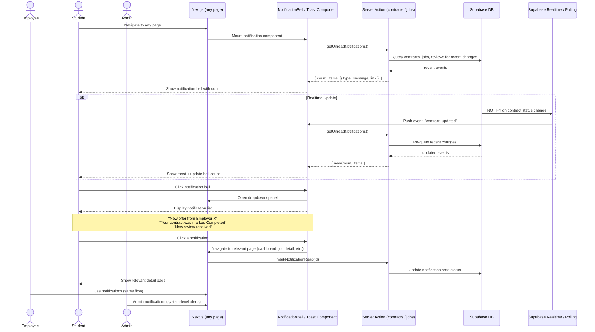

---

### UC-12: Ratings & Reviews

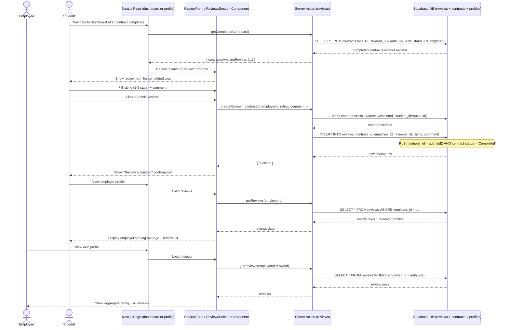

---

## Module: Administration

### UC-13: Identity & Content Verification

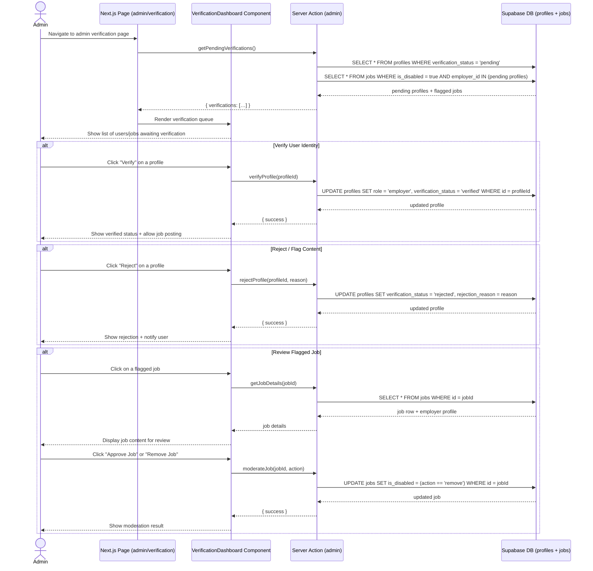

---

### UC-14: Admin Dashboard

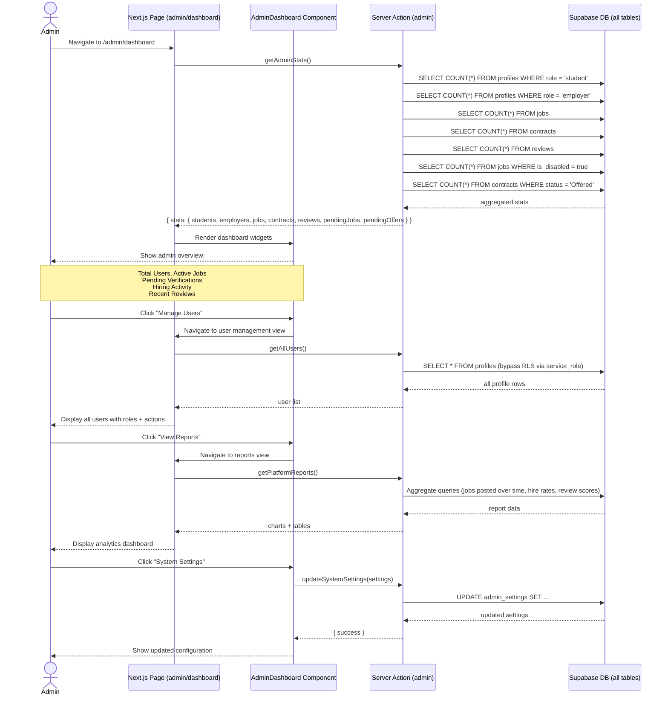

---

## Diagram Index

| # | Use Case | File Section | Actors |
|---|----------|--------------|--------|
| 1 | Sign In | UC-1 | Employee, Student, Admin |
| 2 | Sign Up | UC-2 | Employee, Student |
| 3 | Manage Account & Profile | UC-3 | Employee, Student, Admin |
| 4 | Browse / Search / Filter Gigs | UC-4 | Student, Admin |
| 5 | View Gig Details | UC-5 | Employee, Student, Admin |
| 6 | Save / Bookmark Gigs | UC-6 | Student |
| 7 | Post a Gig | UC-7 | Employee |
| 8 | Manage Posted Gigs & Applicants | UC-8 | Employee, Admin |
| 9 | Apply to a Gig | UC-9 | Student |
| 10 | Track Applications | UC-10 | Student |
| 11 | Notifications | UC-11 | Employee, Student, Admin |
| 12 | Ratings & Reviews | UC-12 | Employee, Student |
| 13 | Identity & Content Verification | UC-13 | Admin |
| 14 | Admin Dashboard | UC-14 | Admin |
